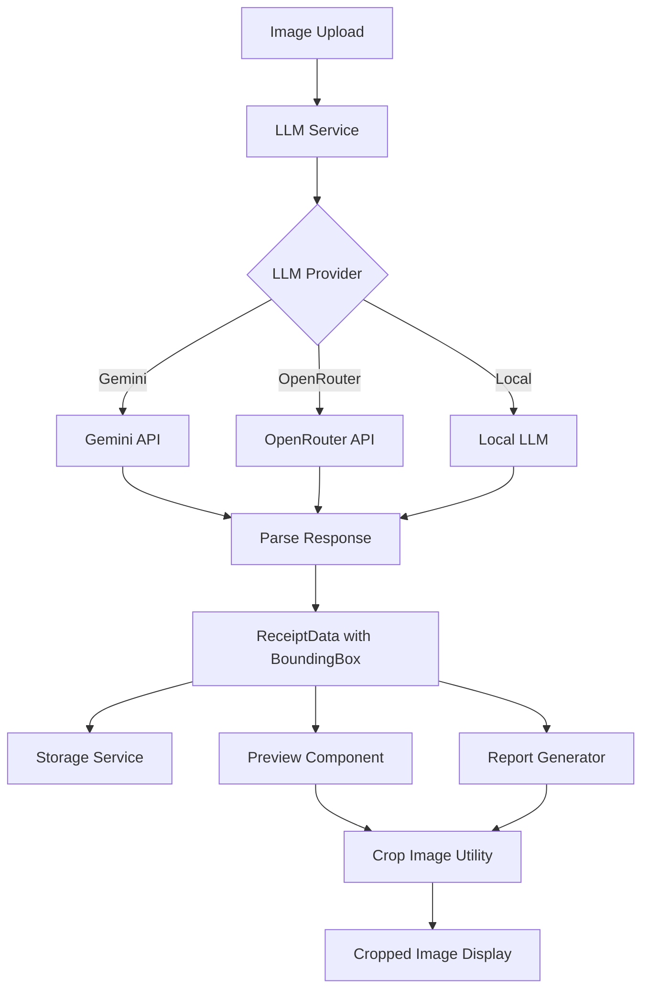

# Design Document: Receipt Bounding Box Detection

## Overview

This feature enhances the receipt processing system to detect and return bounding box coordinates for the actual receipt area within scanned images. This enables cropping out irrelevant parts (like white margins from A4 scanning) during preview display and report generation.

The solution modifies the LLM prompt to request bounding box detection, updates the data types to include bounding box information, and implements cropping utilities for preview and report generation.

## Architecture



## Components and Interfaces

### 1. Type Definitions (types.ts)

Add bounding box type to the ReceiptData interface:

```typescript
// Bounding box in normalized coordinates (0-1000 scale)
// Format: [ymin, xmin, ymax, xmax]
export type BoundingBox = [number, number, number, number] | null;

export interface ReceiptData extends Record<string, any> {
  id: string;
  createdAt: number;
  status: ReceiptStatus;
  rawImage?: string;
  boundingBox?: BoundingBox; // New field for receipt area coordinates
}
```

### 2. Settings Service (settingsService.ts)

Update the default prompt and schema to include bounding box detection:

```typescript
const DEFAULT_PROMPT = `Analyze this receipt image and extract the details according to the provided JSON schema.
Ensure all numeric values are numbers, and dates are in YYYY-MM-DD format.

Additionally, detect the receipt area in the image and return its bounding box in normalized coordinates (0-1000 scale).
The bounding box should be returned as [ymin, xmin, ymax, xmax] where:
- ymin: top edge (0 = top of image, 1000 = bottom)
- xmin: left edge (0 = left of image, 1000 = right)
- ymax: bottom edge
- xmax: right edge

If the receipt fills the entire image or no distinct receipt boundary is detected, return null for boundingBox.`;

const DEFAULT_SCHEMA = JSON.stringify({
  type: "object",
  properties: {
    // ... existing properties ...
    boundingBox: {
      type: "array",
      items: { type: "number" },
      minItems: 4,
      maxItems: 4,
      description: "Receipt bounding box as [ymin, xmin, ymax, xmax] in 0-1000 normalized coordinates, or null if not detected"
    }
  },
  required: ["merchantName", "totalAmount", "category"]
}, null, 2);
```

### 3. LLM Service (llmService.ts)

The LLM service already uses the configurable prompt and schema from settings. The bounding box will be automatically included in the response when the updated prompt/schema is used.

### 4. Image Cropping Utility (utils/imageCropUtils.ts)

New utility for cropping images based on bounding box:

```typescript
export interface CropOptions {
  padding?: number; // Extra padding around the bounding box (in pixels)
}

/**
 * Crops an image based on normalized bounding box coordinates (0-1000 scale)
 * @param imageDataUrl - Base64 data URL of the image
 * @param boundingBox - [ymin, xmin, ymax, xmax] in 0-1000 scale
 * @param options - Optional cropping options
 * @returns Promise<string> - Cropped image as base64 data URL
 */
export const cropImageByBoundingBox = async (
  imageDataUrl: string,
  boundingBox: [number, number, number, number],
  options?: CropOptions
): Promise<string> => {
  // Implementation using canvas
};

/**
 * Validates bounding box coordinates
 * @param boundingBox - The bounding box to validate
 * @returns boolean - True if valid
 */
export const isValidBoundingBox = (
  boundingBox: any
): boundingBox is [number, number, number, number] => {
  // Validation logic
};
```

### 5. Preview Component Updates

Update receipt preview components to use cropped images when bounding box is available, with toggle for full image view.

### 6. Report Generator Updates

Update PDF and HTML report generators to use cropped images when bounding box data is available.

## Data Models

### BoundingBox Type

```typescript
// Normalized coordinates (0-1000 scale)
// [ymin, xmin, ymax, xmax]
type BoundingBox = [number, number, number, number] | null;
```

Coordinate system:
- Origin (0, 0) is top-left corner
- (1000, 1000) is bottom-right corner
- ymin/ymax: vertical position (0 = top, 1000 = bottom)
- xmin/xmax: horizontal position (0 = left, 1000 = right)

### Updated ReceiptData

```typescript
interface ReceiptData {
  id: string;
  createdAt: number;
  status: ReceiptStatus;
  rawImage?: string;
  boundingBox?: BoundingBox;
  // ... other existing fields
}
```

## Correctness Properties

*A property is a characteristic or behavior that should hold true across all valid executions of a system—essentially, a formal statement about what the system should do. Properties serve as the bridge between human-readable specifications and machine-verifiable correctness guarantees.*

### Property 1: Bounding Box Coordinate Validity

*For any* bounding box returned by the system, all four coordinates SHALL be within the range [0, 1000] and ymin < ymax and xmin < xmax.

**Validates: Requirements 1.1, 1.2**

### Property 2: Bounding Box Structure Integrity

*For any* ReceiptData object with a non-null bounding box, the boundingBox field SHALL be an array of exactly 4 numbers in [ymin, xmin, ymax, xmax] order.

**Validates: Requirements 1.2, 1.4, 3.1, 3.2**

### Property 3: Bounding Box Persistence Round-Trip

*For any* ReceiptData with a bounding box, storing and then retrieving the data SHALL preserve the exact bounding box coordinates.

**Validates: Requirements 3.3**

### Property 4: Cropping Produces Valid Dimensions

*For any* valid image and valid bounding box, the cropped image dimensions SHALL be proportional to the bounding box dimensions relative to the original image.

**Validates: Requirements 4.1, 5.1, 5.3**

## Error Handling

| Scenario | Handling |
|----------|----------|
| LLM returns invalid bounding box format | Set boundingBox to null, log warning |
| Bounding box coordinates out of range | Clamp to valid range [0, 1000] |
| Cropping fails | Fall back to original image |
| Image data URL invalid | Skip cropping, use original |
| No bounding box in response | Use null, display full image |

## Testing Strategy

### Unit Tests

1. **Bounding Box Validation**
   - Test isValidBoundingBox with valid coordinates
   - Test with invalid formats (wrong length, non-numbers)
   - Test with out-of-range values
   - Test with inverted coordinates (ymin > ymax)

2. **Image Cropping**
   - Test cropImageByBoundingBox with valid inputs
   - Test with edge cases (full image, tiny crop area)
   - Test with padding options

3. **Schema Updates**
   - Verify DEFAULT_SCHEMA includes boundingBox field
   - Verify DEFAULT_PROMPT includes bounding box instructions

### Property-Based Tests

Using a property-based testing library (e.g., fast-check for TypeScript):

1. **Property 1: Coordinate Validity**
   - Generate random bounding boxes
   - Verify all coordinates are within [0, 1000]
   - Verify ymin < ymax and xmin < xmax
   - Tag: **Feature: receipt-bounding-box, Property 1: Bounding Box Coordinate Validity**

2. **Property 2: Structure Integrity**
   - Generate random ReceiptData objects
   - Verify boundingBox is array of 4 numbers or null
   - Tag: **Feature: receipt-bounding-box, Property 2: Bounding Box Structure Integrity**

3. **Property 3: Persistence Round-Trip**
   - Generate random ReceiptData with bounding boxes
   - Store and retrieve
   - Verify bounding box is preserved exactly
   - Tag: **Feature: receipt-bounding-box, Property 3: Bounding Box Persistence Round-Trip**

4. **Property 4: Cropping Dimensions**
   - Generate random images and bounding boxes
   - Crop and verify output dimensions
   - Tag: **Feature: receipt-bounding-box, Property 4: Cropping Produces Valid Dimensions**

### Test Configuration

- Property tests: minimum 100 iterations per property
- Use fast-check library for TypeScript property-based testing
- Each property test must reference its design document property number
